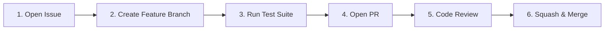

# Contributing to StreamPulse

Thank you for your interest in contributing to **StreamPulse**! StreamPulse is a high-throughput, real-time data ingestion and anomaly classification pipeline.

---

## 📜 Table of Contents

1. [Code of Conduct](#code-of-conduct)
2. [Licensing & Commercial Boundary](#licensing--commercial-boundary)
3. [Developer Certificate of Origin (DCO)](#developer-certificate-of-origin-dco)
4. [Contribution Workflow](#contribution-workflow)
5. [Domain Packs & Ingestion Architecture](#domain-packs--ingestion-architecture)
6. [Local Development & Setup](#local-development--setup)
7. [Testing Standards](#testing-standards)
8. [Commit Message Standards](#commit-message-standards)
9. [Security & Vulnerability Disclosure](#security--vulnerability-disclosure)

---

## 🤝 Code of Conduct

All participants agree to maintain professional, inclusive, and constructive communication.

---

## ⚖️ Licensing & Commercial Boundary

StreamPulse is licensed under the **GNU Affero General Public License v3.0 (AGPL-3.0)**.

- **Open Source Contributions**: All code submissions are licensed under AGPL-3.0.
- **Commercial & Enterprise Licensing**: For organizations requiring closed-source deployment, OEM redistribution, or exemption from AGPL-3.0 copyleft obligations, commercial licensing is provided via **OmniIntelOS**. See [`COMMERCIAL.md`](./COMMERCIAL.md) or contact `siddoyacinetech227@gmail.com`.

---

## ✍️ Developer Certificate of Origin (DCO)

All commits must include a sign-off certifying adherence to the Developer Certificate of Origin (`git commit -s`):

```bash
git commit -s -m "feat(pipeline): add zero-copy streaming CSV ingestion buffer"
```

---

## 📦 Domain Packs & Ingestion Architecture

StreamPulse is domain-agnostic:
- Pipeline routes data against configurable domain taxonomies (`domain_packs/`).
- Connectors (Webhooks, CSV, JSON, Kafka/SSE) must handle streaming payloads with backpressure and graceful error recovery.
- Zero-downtime classification fallback: if remote vector inference is cold, pipeline gracefully falls back to fast keyword/heuristic classification.

---

## 🔄 Contribution Workflow



1. **Issue First**: Open an issue for discussion before significant refactors.
2. **Branch**: Create a branch from `master` (`feat/...` or `fix/...`).
3. **Tests**: Ensure all local tests pass.
4. **Pull Request**: Open a PR referencing the issue.

---

## 🛠️ Local Development & Setup

### Prerequisites
- Python 3.11+
- PostgreSQL (optional for local mocked tests; SQLite fallback is supported)

### Environment Setup
```bash
# 1. Clone repository
git clone https://github.com/Yacine-ai-tech/StreamPulse.git
cd StreamPulse

# 2. Virtual environment setup
python3 -m venv venv
source venv/bin/activate

# 3. Install dependencies
pip install -e .
pip install -r requirements.txt

# 4. Copy environment template
cp .env.example .env
```

---

## 🧪 Testing Standards

```bash
pytest tests/ -v
```

- Ensure connectors and webhook signature verifications have deterministic tests.
- Offline tests must not depend on external embedding endpoints.

---

## 📝 Commit Message Standards

Use [Conventional Commits](https://www.conventionalcommits.org/):

`feat:`, `fix:`, `docs:`, `test:`, `refactor:`, `perf:`, `chore:`

---

## 🔒 Security & Vulnerability Disclosure

Email `siddoyacinetech227@gmail.com` to report security vulnerabilities privately.
